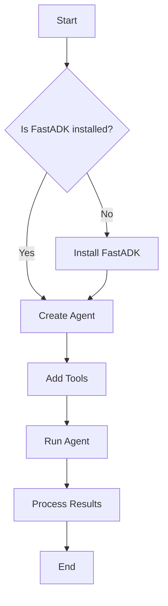
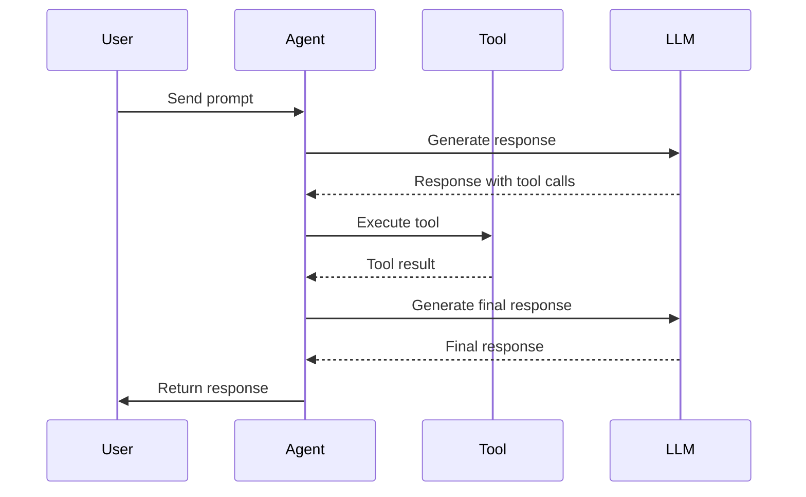
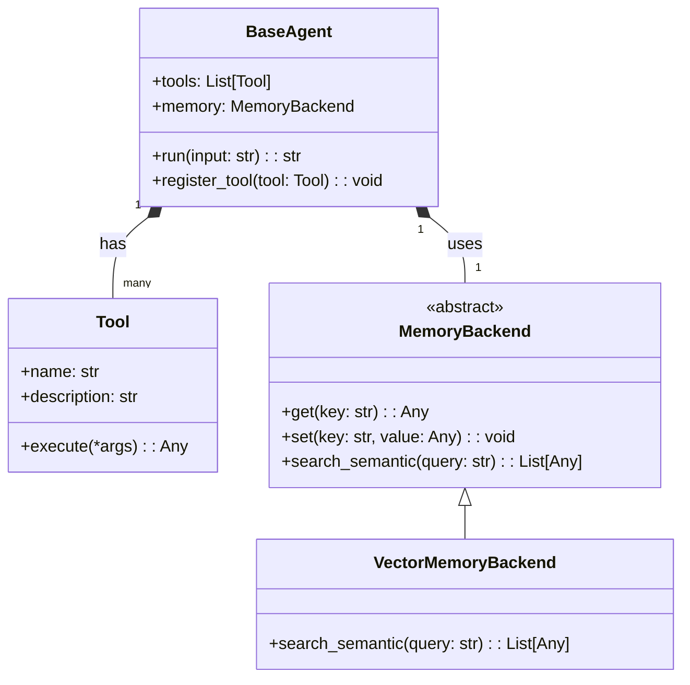
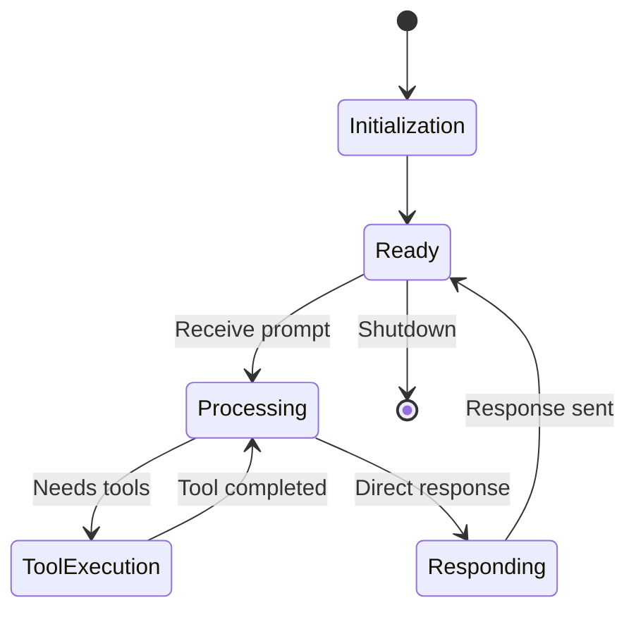
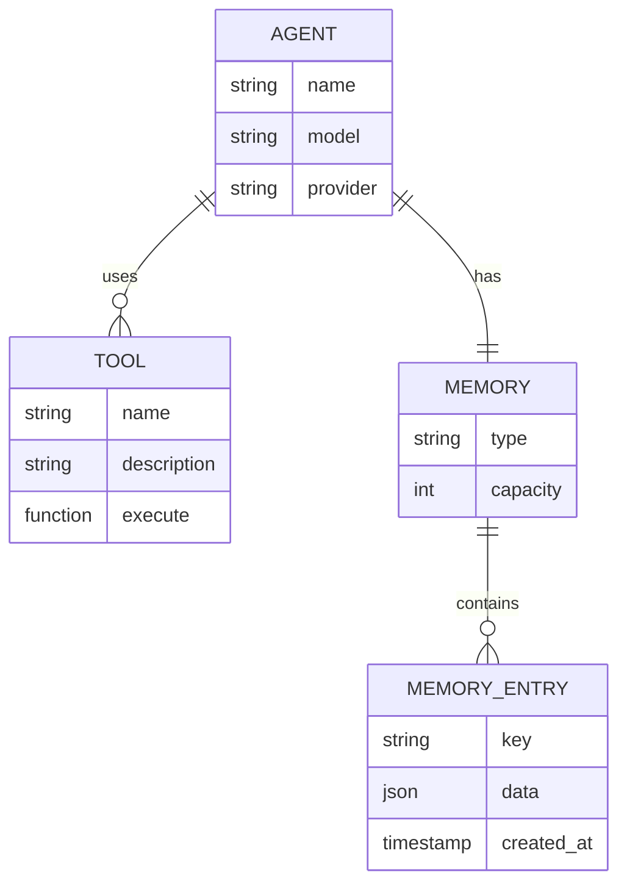

# Mermaid Diagrams Test

This page demonstrates how Mermaid diagrams are now rendered in the FastADK documentation.

## Flowchart Example

## Sequence Diagram Example

## Class Diagram Example

## State Diagram Example

## Entity Relationship Diagram

