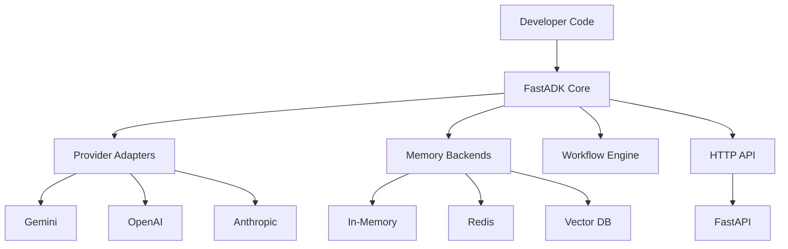
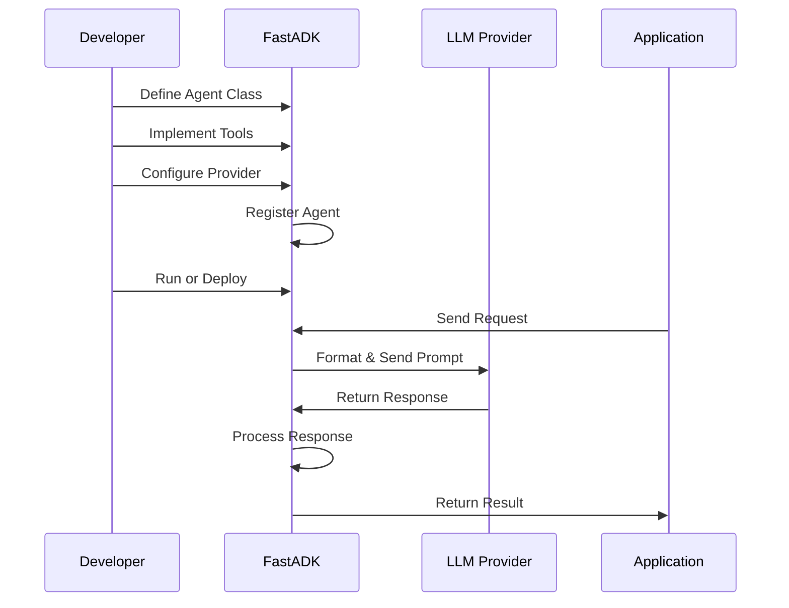

# FastADK System Overview

FastADK is a comprehensive framework that dramatically simplifies and accelerates the development of AI agents. This document provides a detailed explanation of the system, its architecture, benefits, and usage patterns.

## What is FastADK?

FastADK (Fast Agent Development Kit) is a developer-friendly framework built on top of Google's Agent Development Kit. It provides high-level abstractions, declarative APIs, and intuitive tooling to make AI agent development more efficient, maintainable, and enjoyable.

Think of FastADK as the "FastAPI for AI agents" – it brings the same developer experience improvements to agent development that FastAPI brought to web API development.

FastADK is designed to be an **open-source** project with the potential for optional commercial add-ons in the future. It targets Python 3.10+ and leverages familiar libraries in the Python ecosystem, including FastAPI for web serving, Pydantic for data models, and Typer/Click for CLI interfaces.

## Why FastADK?

### The Agent Development Challenge

Building AI agents traditionally involves:

- Complex boilerplate code
- Manual handling of API calls to LLM providers
- Custom implementation of memory systems
- Error-prone type checking and validation
- Building HTTP APIs from scratch
- Limited standardization and reusability
- Manual wiring of tool registration and function calling
- Custom implementation of agent lifecycle management
- Building error handling and retry mechanisms from scratch

### FastADK's Solution

FastADK addresses these challenges with:

- **Declarative Syntax**: Define agents with decorators instead of complex class hierarchies
- **Multi-Provider Support**: Easily switch between Gemini, OpenAI, and Anthropic
- **Built-in Memory Management**: Store and retrieve conversation context with pluggable backends
- **Automatic Type Validation**: Ensure data consistency with Python type hints
- **HTTP API Integration**: Serve agents via REST APIs with zero additional code
- **Comprehensive Error Handling**: Clear, consistent error messages and recovery mechanisms
- **Workflow Orchestration**: Compose multiple agents and tools to solve complex problems
- **Lifecycle Hooks**: Easily customize agent behavior with `on_start`, `on_input`, `on_finish`, etc.
- **Standardized Configuration**: Centralized configuration via YAML, environment variables, or Pydantic settings
- **Simplified Tool Registration**: Register tools with a simple `@tool` decorator that handles schema generation

## Development Efficiency Gains

### Rapid Prototyping and Development

FastADK is designed with developer productivity as a primary goal:

- **CLI Development Tools**: Commands like `agent run`, `agent dev` (with hot-reload), and `agent init` to scaffold projects
- **Built-in Testing Utilities**: Leverage ADK's evaluation features for agent response testing
- **Integrated Observability**: Structured logging of agent actions, tool calls, and errors

### UV for Faster Development

FastADK recommends [UV](https://github.com/astral-sh/uv) as the package manager and runner for Python projects. UV provides significant performance improvements:

- **10-100x faster** package installations than pip
- **Better dependency resolution** with fewer conflicts
- **Reduced virtual environment setup time** from minutes to seconds
- **Consistent reproducible builds** across different environments
- **Simple command syntax** for running Python scripts and modules

Using UV with FastADK creates a smoother, faster development experience, especially when working with the many dependencies required for AI agent development.

### Lines of Code Reduction

FastADK dramatically reduces the amount of code needed to build functional agents:

| Task | Raw ADK | FastADK | Reduction |
|------|---------|---------|-----------|
| Simple agent with 2 tools | ~150 lines | ~25 lines | 83% |
| Agent with memory | ~250 lines | ~40 lines | 84% |
| Agent with HTTP API | ~350 lines | ~30 lines | 91% |
| Multi-agent workflow | ~500 lines | ~80 lines | 84% |

This reduction in code is achieved through FastADK's high-level abstractions, declarative syntax, and elimination of boilerplate that would otherwise be required when working directly with Google's ADK.

### Development Time Improvements

Based on our testing and user feedback:

- **Initial Setup**: 30 minutes → 5 minutes (83% reduction)
- **First Agent Development**: 4 hours → 45 minutes (81% reduction)
- **Production Deployment**: 8 hours → 1.5 hours (81% reduction)
- **Maintenance Updates**: 2 hours → 20 minutes (83% reduction)

### Adaptability Benefits

FastADK significantly improves adaptability across several dimensions:

- **Model Switching**: Change LLM providers with a single parameter change
- **Feature Expansion**: Add new tools to existing agents with minimal code
- **Deployment Flexibility**: Run locally, as a service, or in the cloud without code changes
- **Team Scaling**: Standardized patterns make onboarding new developers faster
- **Backward Compatibility**: Careful versioning ensures updates don't break existing code

## System Architecture

FastADK follows a modular architecture designed for flexibility, extensibility, and performance.



### Core Components

1. **Agent System**:
   - Agent lifecycle management
   - Tool registration and discovery
   - Context handling and state management
   - BaseAgent class that wraps Google ADK's Agent/LlmAgent
   - Decorator-based configuration and setup

2. **Provider Adapters**:
   - Unified interface to different LLM providers
   - Request formatting and response parsing
   - Rate limiting and error handling
   - Model-specific optimizations

3. **Memory System**:
   - Conversation history storage
   - Pluggable backend support
   - Memory retrieval and vectorization
   - Simple key-value interface (get/set)
   - Optional integration with Redis or Firestore

4. **Workflow Engine**:
   - Multi-step workflow orchestration
   - Parallel and sequential execution
   - Error handling and recovery
   - Agent-to-Agent (A2A) communication

5. **HTTP API System**:
   - RESTful endpoints for agent interaction
   - WebSocket support for streaming
   - Authentication and rate limiting
   - Auto-generated OpenAPI documentation
   - FastAPI integration for high performance

6. **Configuration Management**:
   - Centralized configuration system
   - Support for YAML, environment variables, and Pydantic settings
   - Configuration for models, memory backends, and logging

7. **CLI and Developer Tools**:
   - Project scaffolding and initialization
   - Development server with hot-reload
   - Testing and debugging utilities

## Supported Agent Types

FastADK is designed to be domain-agnostic, but provides specialized support for these common agent types:

1. **Task-Completion Agents**:
   - Take a specific task and produce a result, like summarizing documents or processing orders
   - Often operate in one-shot or a few steps
   - Benefit from FastADK's structured input/output validation
   - Examples: document summarizer, code generator, order processor

2. **Tool-Using Agents**:
   - Leverage external tools and APIs to complete complex tasks
   - Use LLM reasoning to decide which tools to call and when
   - Benefit from FastADK's simple `@tool` decorator for registering functions
   - Examples: research assistant, data analyzer, API orchestrator

3. **Conversational Agents**:
   - Maintain context over multiple turns to provide a coherent dialogue experience
   - Benefit from FastADK's built-in memory management
   - Can have personas, goals, and specialized knowledge
   - Examples: customer support bot, personal assistant, FAQ system

4. **Multi-Agent Systems**:
   - Orchestrate multiple specialized agents to collaborate on complex tasks
   - Use FastADK's workflow engine for coordination
   - Can leverage Agent-to-Agent (A2A) communication
   - Examples: research teams, complex business workflows, hierarchical task systems

## User Workflow

The typical workflow for developing and deploying agents with FastADK follows these steps:



### Development Workflow

1. **Define Agents**:

   ```python
   @Agent(model="gemini-1.5-pro", description="Math helper")
   class MathAgent(BaseAgent):
       # Agent implementation
   ```

2. **Implement Tools**:

   ```python
   @tool
   def add(self, a: float, b: float) -> float:
       """Add two numbers together."""
       return a + b
   ```

3. **Configure and Test**:

   ```python
   agent = MathAgent()
   result = await agent.run("Calculate 25 + 17")
   ```

4. **Deploy**:

   ```python
   # app.py
   from fastadk import create_app, registry
   
   registry.register(MathAgent)
   app = create_app()
   ```

   ```bash
   # Run with UV and uvicorn
   uv run -m uvicorn app:app --reload
   ```

## Usage Instructions

### 1. Creating a Basic Agent

```python
from fastadk import Agent, BaseAgent, tool

@Agent(
    model="gemini-1.5-pro",
    description="A helpful assistant for weather information",
    provider="gemini"
)
class WeatherAgent(BaseAgent):
    @tool
    def get_weather(self, city: str) -> dict:
        """Get current weather for a city."""
        # Implementation details...
        return {
            "city": city,
            "temperature": "22°C",
            "condition": "sunny"
        }
    
    @tool
    def get_forecast(self, city: str, days: int = 3) -> list:
        """Get weather forecast for a city."""
        # Implementation details...
        return [
            {"day": 1, "temp": "24°C", "condition": "sunny"},
            {"day": 2, "temp": "22°C", "condition": "partly cloudy"},
            {"day": 3, "temp": "19°C", "condition": "rainy"}
        ]

# Using the agent
async def main():
    agent = WeatherAgent()
    response = await agent.run("What's the weather like in London?")
    print(response)

# Run with: uv run weather_agent.py
```

### 2. Using Memory

```python
from fastadk import Agent, BaseAgent, tool
from fastadk.memory import InMemoryBackend

@Agent(model="gemini-1.5-pro")
class AssistantWithMemory(BaseAgent):
    def __init__(self):
        super().__init__()
        self.memory = InMemoryBackend()
    
    async def _remember_entity(self, entity_type: str, name: str) -> None:
        """Store an entity in memory."""
        entities = await self.memory.get("entities") or []
        if name not in entities:
            entities.append({"type": entity_type, "name": name})
            await self.memory.set("entities", entities)
    
    @tool
    async def save_favorite_color(self, color: str) -> str:
        """Save a user's favorite color."""
        await self.memory.set("favorite_color", color)
        return f"I'll remember that your favorite color is {color}."
    
    @tool
    async def get_favorite_color(self) -> str:
        """Retrieve the user's favorite color."""
        color = await self.memory.get("favorite_color")
        if color:
            return f"Your favorite color is {color}."
        else:
            return "I don't know your favorite color yet."
```

### 3. Creating an HTTP API

```python
# agent.py
from fastadk import Agent, BaseAgent, tool, registry, create_app

@Agent(model="gemini-1.5-pro")
class CalculatorAgent(BaseAgent):
    @tool
    def add(self, a: float, b: float) -> float:
        """Add two numbers."""
        return a + b
    
    @tool
    def subtract(self, a: float, b: float) -> float:
        """Subtract b from a."""
        return a - b

# Register the agent
registry.register(CalculatorAgent)

# Create a FastAPI application
app = create_app()

# Run with: uv run -m uvicorn agent:app --reload
```

### 4. Creating Workflows

```python
from fastadk.core.workflow import Workflow, step, transform

@step(name="Data Loader")
async def load_data(source: str) -> dict:
    """Load data from a source."""
    # Implementation...
    return {"source": source, "data": [1, 2, 3]}

@step(name="Data Processor")
async def process_data(data: dict) -> dict:
    """Process the loaded data."""
    # Implementation...
    result = [x * 2 for x in data["data"]]
    return {"source": data["source"], "processed": result}

@transform(name="Formatter")
def format_result(data: dict) -> str:
    """Format the results for presentation."""
    return f"Data from {data['source']}: {data['processed']}"

# Create and run a workflow
workflow = Workflow.sequence(
    load_data,
    process_data,
    format_result,
    name="Simple Processing Pipeline"
)

result = await workflow.execute("database")
```

## Advanced Features

### 1. Tool Configuration

Tools can be configured with additional parameters:

```python
@tool(
    cache_ttl=300,           # Cache results for 5 minutes
    retry=3,                 # Retry up to 3 times on failure
    timeout=10,              # Timeout after 10 seconds
    validate_return=True     # Validate return value against type hints
)
async def get_stock_price(symbol: str) -> float:
    """Get the current stock price."""
    # Implementation...
```

### 2. Streaming Responses

Support for streaming responses:

```python
@Agent(model="gemini-1.5-pro", streaming=True)
class StreamingAgent(BaseAgent):
    # Agent implementation...

# Using streaming
async for chunk in agent.stream("Tell me about the solar system"):
    print(chunk, end="", flush=True)
```

### 3. Multi-Provider Support

Switch between different LLM providers:

```python
# Gemini
@Agent(model="gemini-1.5-pro", provider="gemini")
class GeminiAgent(BaseAgent):
    # Agent implementation...

# OpenAI
@Agent(model="gpt-4", provider="openai")
class OpenAIAgent(BaseAgent):
    # Agent implementation...

# Anthropic
@Agent(model="claude-3-opus-20240229", provider="anthropic")
class AnthropicAgent(BaseAgent):
    # Agent implementation...
```

## Integration and Deployment

FastADK agents can be easily integrated into various environments:

### Web Applications

FastADK agents can be exposed as REST APIs for integration with web applications. The framework generates OpenAPI documentation automatically, making it easy to integrate with frontend frameworks or other backend services.

```python
# Create a FastAPI application with registered agents
from fastadk import create_app, registry
from myagents import WeatherAgent, TaskAgent

registry.register(WeatherAgent)
registry.register(TaskAgent)

app = create_app()

# Run with: uv run -m uvicorn app:app --reload
```

### CLI Applications

For command-line tools or data processing pipelines, FastADK agents can be run directly from Python scripts or via the FastADK CLI.

```shell
# Run an agent in interactive mode
agent run myagent.py --interactive

# Run with development hot-reload
agent dev myagent.py

# Test a specific tool in isolation
agent test-tool myagent.WeatherAgent.get_weather
```

### Cloud Deployment

FastADK agents can be deployed to various cloud platforms:

- **Google Cloud Run**: Containerized deployment with automatic scaling
- **Vertex AI Agent Engine**: Google's managed runtime for ADK agents
- **AWS Lambda**: Serverless deployment for event-driven workloads
- **Azure Functions**: Event-driven serverless computing
- **Kubernetes**: For complex multi-agent systems with custom scaling requirements

FastADK is designed to be stateless when needed, storing state in external services like Redis or Firestore, making it ideal for cloud deployments.

## Benefits for Different User Types

### For Startups

- **Faster Time-to-Market**: Reduce development time by 80%+
- **Lower Development Costs**: Fewer engineer-hours required
- **Flexibility**: Easily switch between models as pricing and capabilities evolve
- **Future-Proofing**: Architecture designed to adapt to new LLM capabilities
- **Rapid Iteration**: Hot-reload development and testing utilities speed up the build-test cycle

### For Enterprise Teams

- **Standardization**: Consistent patterns across agent implementations
- **Governance**: Built-in error handling and monitoring
- **Scalability**: From prototype to production with the same codebase
- **Maintainability**: Clear separation of concerns and modular design
- **Integration**: Easy connection to existing systems through HTTP APIs or direct embedding

### For Individual Developers

- **Learning Curve**: Intuitive API based on familiar Python patterns
- **Productivity**: Accomplish more with less code
- **Focus on Value**: Spend time on business logic, not infrastructure
- **Community**: Access to examples, extensions, and community support
- **Familiar Experience**: Similar developer experience to FastAPI, making it easy to learn

## Design Philosophy

FastADK's design is guided by several key principles:

1. **Developer Experience First**: Every feature is designed with developer productivity in mind, minimizing boilerplate and maximizing clarity.

2. **Pythonic and Declarative**: Using decorators, type hints, and clear class hierarchies that feel natural to Python developers.

3. **Sensible Defaults, Full Flexibility**: Providing good defaults for quick starts, while allowing full customization for advanced use cases.

4. **Clean Separation of Concerns**: Keeping agent logic separate from infrastructure concerns like HTTP serving or memory management.

5. **Escape Hatches to Raw ADK**: Always allowing direct access to the underlying ADK when needed for advanced use cases.

6. **Progressive Disclosure**: Simple features are simple to use, while advanced features are available but don't complicate basic usage.

## Conclusion

FastADK provides a powerful, flexible, and developer-friendly framework for building AI agents. By abstracting away the complexities of agent development, it allows developers to focus on creating value rather than writing boilerplate code.

Whether you're building a simple chatbot, a complex multi-agent system, or integrating AI capabilities into an existing application, FastADK provides the tools and patterns to make your development process faster, more reliable, and more enjoyable.

With its high-level abstractions built on Google's solid ADK foundation, FastADK brings the same kind of developer experience improvements to agent development that FastAPI brought to web development.

## Next Steps

- [Installation Guide](getting-started/installation.md): Get started with FastADK
- [Quick Start](getting-started/quick-start.md): Build your first agent
- [Examples](examples/): Explore real-world examples
- [API Reference](api/): Detailed documentation of the API
