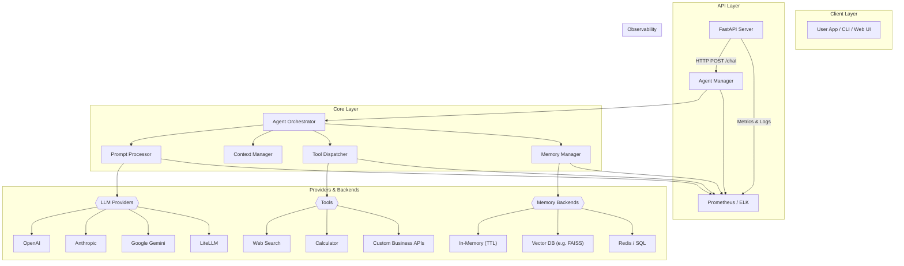
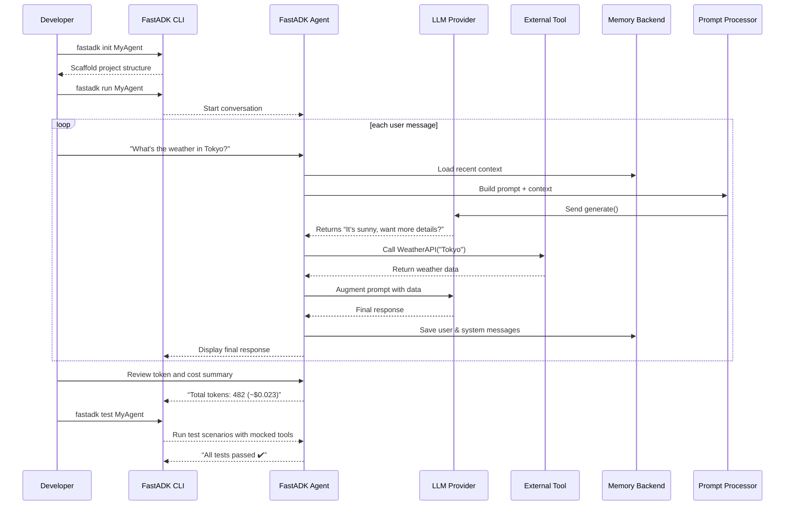

# Enhancing the FastADK Framework

## Implement Token and Cost Tracking

**Why:** FastADK currently supports multiple LLM providers (Google Gemini, OpenAI, Anthropic), each of which charges by token usage. However, the framework does not yet provide built-in visibility into how many tokens are consumed per query or the estimated cost. Adding token and cost tracking will help developers optimize prompts and control expenses.

**What to Improve:**

* **Automatic Token Counting:** Integrate token counting for each model provider. For example, when using OpenAI APIs, capture the `usage` data from responses (prompt tokens, completion tokens) and log them. For Google/Anthropic models, use available token count utilities or estimate based on input length.
* **Cost Estimation:** Provide a utility to calculate cost by multiplying token counts with the provider’s pricing. This could be configured via the model config (e.g. price per 1K tokens). The agent could output a summary like “Query used 750 tokens (\~\$0.015)” after each run.
* **Developer Alerts:** Optionally allow setting a token or cost budget per session; the system can warn or error if a single query or cumulative usage exceeds a threshold. This prevents runaway costs in production.
* **Observability Integration:** Tie token/cost metrics into the logging and metrics system (which already exists in FastADK). For example, emit a log or Prometheus metric for tokens\_used\_per\_request and total\_cost. This aligns with the framework’s goal of comprehensive observability.

**Benefit:** Developers will have transparency into resource usage, making the framework more **cost-efficient and trustworthy** for production use. It encourages prompt efficiency and helps in budgeting when deploying at scale.

## Improve Context Management and Memory (Context Engineering)

**Why:** Effective use of conversation context is crucial for tool-using agents. FastADK provides conversation memory with pluggable backends (currently an in-memory store with TTL), but there’s room to make context handling more powerful. “Context engineering” refers to techniques for managing what information the agent retains and provides to the model, especially as conversations grow or across sessions.

**What to Improve:**

* **Sliding Window & Summarization:** Implement a strategy to maintain conversation history within token limits. For long dialogues, older turns can be summarized and stored as a concise summary, freeing up space for recent content. This prevents context overflow while preserving important info. The framework can automatically summarize when memory exceeds a threshold.
* **Vector Store Integration:** Add **vector-based memory** to complement or replace the current list memory. This is already on the roadmap (enhanced vector memory support is “coming soon”). By integrating a vector database (FAISS, Pinecone, etc.), agents could perform semantic search over past interactions or domain knowledge. For example, a user question can trigger retrieving relevant facts or past dialogue from a vector store to include in context. This upgrade would let agents handle **retrieval-augmented generation (RAG)** use cases seamlessly.
* **Long-Term Memory and Persistence:** Enable optional persistent memory backends. In addition to the transient in-memory (TTL-based) memory, provide backends like Redis or database storage so an agent can recall information across runs or sessions. This is useful for agents that need long-term knowledge of users or tasks.
* **Configurable Context Length & Policy:** Let developers configure how much history to include (e.g. last N messages, or last M tokens). Provide built-in policies (e.g. *most recent*, *summarize older*, *knowledge-base retrieval*) that can be selected or combined. This **context engineering** flexibility ensures the agent uses context optimally for different use cases.
* **System and Role Prompt Engineering:** Expose easy ways to set system prompts or role instructions for the agent. For instance, an agent’s class could have a configurable persona or instructions that always prepend the conversation. This allows developers to fine-tune the agent’s behavior without hardcoding it.

**Benefit:** These improvements will make FastADK agents more **context-aware and capable** of handling complex, long-running conversations or large knowledge bases. Developers can trust the agent to manage its context window intelligently, leading to more relevant responses and better user experience.

## Scalability and Performance Optimizations

**Why:** To be production-ready (“in minutes, not months”), FastADK should perform well under load and scale easily. Currently the framework uses Python async/await (as shown in the quickstart example) for concurrency, but we can further optimize how agents execute, cache results, and parallelize tasks.

**What to Improve:**

* **Concurrent Agent Execution:** Ensure that multiple agent instances or multiple requests to the same agent can run in parallel without bottlenecks. This might involve making internal model API calls truly asynchronous and thread-safe. If certain tool calls are blocking (e.g. heavy compute or network I/O), consider running them in an executor or separate threads so they don’t stall the event loop.
* **Workflow Parallelism:** The framework already supports parallel tool execution in workflows. To enhance this, provide high-level APIs for running sub-tasks concurrently and then aggregating results. For example, an agent might query multiple tools (e.g. different APIs) at once. FastADK can simplify launching these coroutines and waiting for all results, with error handling for any failures. This makes complex agents more efficient.
* **Caching Mechanisms:** Introduce caching for model outputs or tool results. The release notes mention *advanced caching mechanisms* are planned. Concretely, developers could enable a cache (in-memory or persistent) that keys responses by prompt + tool inputs. For deterministic tools or identical prompts, the agent can return a cached answer instantly instead of recomputing. This is especially useful during development or for repetitive queries, reducing latency and API calls.
* **Lazy Tool Invocation:** If an agent has multiple tools, optimize the decision process so that tools are called only when needed. For instance, if the LLM’s response already contains the answer without requiring a tool, avoid unnecessary tool execution. This might involve analyzing the LLM output or using the ADK’s agent reasoning to skip steps that aren’t needed – thereby saving time.
* **Batching Requests:** Where possible, batch operations. If the framework or underlying ADK supports sending multiple queries in one API call (for example, bulk embedding requests to a vector store or multi-query prompts), provide utilities to batch to reduce overhead.
* **Resource Utilization:** Offer guidance or utilities for horizontal scaling – e.g., deploying agents on serverless platforms or Kubernetes. FastADK is designed to scale to containerized, serverless environments, so documenting best practices for scaling (like stateless design, externalizing memory as mentioned) will help. Possibly include a sample Dockerfile or deployment scripts to jump-start production deployment.

**Benefit:** Optimizations will make FastADK more **high-performance and scalable**. In practice, this means lower latency for end-users and the ability to handle more concurrent conversations. Organizations can confidently deploy FastADK-based agents in production, knowing that the framework can scale with demand.

## Extensibility and Integration Across Use Cases

**Why:** FastADK’s open-source audience is developers who will have diverse needs. The framework already offers pluggable components (e.g. memory backends and multi-model support). Pushing extensibility further ensures the system can adapt to *all possible use cases* and integrate with other tools or platforms.

**What to Improve:**

* **Plugin Architecture:** Define clear interfaces for extending core components. For example, a **Model Provider interface** for adding new LLM providers. While Gemini, OpenAI, and Anthropic are supported out-of-the-box, someone might want to plug in Cohere, HuggingFace local models, or future models. If FastADK provides an abstract base class or protocol for model drivers (with methods like `generate(prompt)`), contributors can add new providers easily. Similarly, formalize interfaces for custom Memory backends and Tool integrations.
* **Tool Ecosystem:** Encourage a **library of reusable tools**. Many AI agents use similar tools (web search, calculators, database queries, etc.). FastADK could provide a set of common tools (or examples) that developers can import, rather than writing from scratch. This might include web scraping, math, or file I/O tools with safety checks. Even better, allow the community to contribute tool packs. A registry of known tools could make agent-building faster and more powerful.
* **Integration with External Systems:** Make it easier to connect agents to real-world applications. This could mean providing **adapters or templates** for common integrations: Slack bots, Discord bots, email responders, or voice assistants. For instance, a SlackBot class could wrap a FastADK agent to handle Slack events. Although developers can write this themselves, providing official integration examples increases the framework’s usefulness across domains.
* **HTTP API and Beyond:** FastADK already generates FastAPI routes for serving agents. Build on this by offering more API options: authentication (API keys, OAuth) for secured endpoints, and support for streaming responses via websockets or Server-Sent Events (so that if the model streams tokens, clients can receive partial output in real-time). These make the agent service more robust and interactive for end users.
* **Workflow and Multi-Agent Orchestration:** Expand the workflow orchestration feature to allow **multi-agent systems**. For example, one could define multiple agents that specialize in different tasks and have them collaborate (Agent A calls Agent B as a tool). FastADK can facilitate this by allowing agents to be composed or call each other in workflows. This aligns with Google’s concept of multi-agent systems on Vertex AI. Providing patterns for agent-to-agent interactions (and maybe integrating Google’s A2A protocol in the future) would open up advanced use cases.
* **Fine-Tuning and Custom Models:** As noted in the roadmap, adding fine-tuning support is important. Integrate with providers’ fine-tuning APIs (OpenAI fine-tuning endpoints, or Vertex AI custom model training) so developers can improve their agents’ performance on domain-specific data. Even a simple interface to swap in a fine-tuned model checkpoint for an agent’s underlying model would be valuable. This makes FastADK useful not just for prompting but for deploying specialized models.

**Benefit:** By being highly extensible, FastADK becomes a **future-proof and versatile** framework. Developers can extend it to new providers, tools, and scenarios without hacking the core, and the framework can integrate into a wide variety of applications (from chatbots to automation scripts). This “think big” approach ensures FastADK can serve as a central hub for AI agent development in many contexts.

## Developer Experience and Tooling

**Why:** A top goal is to make FastADK easy and enjoyable for developers. Beyond core functionality, we should enhance the tooling around the framework – CLI, testing, debugging – so that building and maintaining agents is frictionless. The current CLI and testing utilities are a great start (FastADK has an interactive CLI and a built-in testing framework), but we can do more.

**What to Improve:**

* **Interactive CLI Enhancements:** Transform the CLI into a richer developer tool. For instance, support a **REPL mode** where a developer can converse with the agent step-by-step and see what tools it’s invoking in real time. The CLI could display each intermediate step (tool selected, API calls made, etc.) with color-coded output. This would act as a live debugger for agent logic. Additionally, add commands in the CLI to inspect or reset the agent’s memory, switch configs, or simulate different environments.
* **Debugging Aids:** Provide utilities to trace an agent’s decision process. Since FastADK agents likely involve an LLM deciding when to use tools, it’s useful to expose the chain-of-thought (e.g. the reasoning or the intermediate prompts). Even if the raw reasoning from the LLM isn’t directly accessible, FastADK could log which tool was used and why. The `tools_used` list in tests shows that the framework tracks tool usage; expanding this, we can log timestamps, inputs/outputs of each tool call, and LLM outputs before and after tool usage. Such structured debug logs can be turned on in a “verbose” mode for troubleshooting.
* **Enhanced Testing Framework:** The existing `AgentTest` and `@test_scenario` utilities allow writing scenario-based async tests. We can build on this by providing **mock tool responses** or stubbed LLM outputs for deterministic testing. For example, allow developers to supply a fake LLM that always returns a certain output, so tests can verify the agent behaves correctly without calling external APIs. Also, include coverage for multi-turn conversations and edge cases (like tool errors) in the testing toolkit. This will increase confidence in agent reliability.
* **Configuration and Environment Management:** Simplify how developers manage configurations for different environments (dev, staging, prod). FastADK already supports YAML/TOML and env vars; consider adding a CLI command to quickly generate a config template or to validate the config. Additionally, a feature to *hot-reload* configuration in a running agent (especially for long-lived API servers) could be useful – e.g. update logging level or model parameters on the fly.
* **IDE Integration:** With strong typing already emphasized, ensure the code has thorough type hints and docstrings so that IDEs can provide auto-complete and documentation. We might also provide a VSCode snippet or extension for FastADK, for example snippets that auto-generate an Agent class template or tool function template. This lowers the barrier for new developers.
* **Performance Profiling:** For power users, include options to profile an agent’s performance (time spent in the LLM vs tools, etc.). This could be a mode where each run prints a breakdown of timings, which helps in optimizing slow steps.

**Benefit:** These improvements elevate the **developer experience** – making debugging easier, testing more robust, and iteration faster. A smoother developer journey means more adoption and a stronger community, as users can quickly go from prototype to production and troubleshoot issues with confidence.

## Observability and Monitoring Improvements

**Why:** FastADK touts comprehensive observability with logging, metrics, and tracing. This is crucial for production agents, so doubling down on monitoring capabilities will make the system even more enterprise-ready. We should ensure that developers and ops teams have full insight into agent behavior in real time.

**What to Improve:**

* **Structured Logging:** Enhance the logging to be more structured (e.g. JSON logs or clearly categorized entries). Important events – like tool invocation, errors, token usage (as noted earlier), and final responses – should be clearly logged with consistent structure. This will make it easier to parse logs or send them to monitoring systems.
* **Monitoring Dashboards:** Provide out-of-the-box integration with monitoring tools. For instance, integrate with **OpenTelemetry** to emit traces and spans for each agent run, so developers can visualize request flow in tools like Jaeger or Stackdriver. Key steps (LLM call, each tool call, memory fetch) can each be a span. Coupled with token/cost metrics, this gives a deep view of performance.
* **Metrics Emission:** In addition to logs, use a metrics library to track frequencies and latencies. Metrics such as “number of conversations served”, “average response time”, “errors per minute”, or even custom metrics like “tool\_X\_usage\_count” can be very valuable. The framework could expose a Prometheus endpoint when running the FastAPI server, making it easy to plug into dashboards.
* **Alerts and Notifications:** For critical conditions (e.g., an agent erroring out frequently or using an unusually high number of tokens), allow hooks for notifications. This could be as simple as logging warnings, or more advanced like sending an event that users can hook into (maybe via a webhook or message). While not core to the library, providing guidelines for setting up alerting based on the emitted metrics would help teams keep their agent healthy.
* **Visualization Tools:** Consider creating a lightweight **web dashboard** for developers running agents locally. This dashboard could list recent queries, the tools invoked, token usage, etc., updating in real-time. It would essentially be a friendly face on top of the logs and metrics. Even a command to generate an HTML report of a single conversation’s trace could be useful for post-mortem analysis.
* **Security in Observability:** Ensure that any sensitive data (API keys, user PII from prompts) is redacted in logs/traces by default. As we increase observability, we should also prevent leaks of sensitive info. Perhaps integrate a configurable filter that removes or hashes certain patterns in logs.

**Benefit:** Upgraded observability makes FastADK agents **transparent and maintainable** in production. Developers can monitor and troubleshoot issues quickly, and organizations can meet reliability requirements. This level of insight is often a deciding factor for enterprise adoption of an AI framework.

## UI/UX and Documentation Enhancements

**Why:** Although FastADK is a backend framework, improving the user interface (in a broad sense) and documentation will lower the learning curve and demonstrate the system’s capabilities. A focus on **ease of use** means clear docs, good examples, and possibly simple UIs for testing agents.

**What to Improve:**

* **Expanded Documentation:** Leverage the existing MkDocs setup to create a rich documentation site. Add more **guides and tutorials** covering common use cases (e.g. building a customer support bot, a data analysis agent, etc.). Each feature (decorators, memory, workflows, API serving) should have its own page with code samples. Also include a “Cookbook” of recipes for doing specific things (like *how to add a new tool*, *how to integrate with Slack*). The goal is to make the docs a one-stop solution for developer questions.
* **Example Projects:** While a few examples exist (Weather Agent, Travel Assistant, etc. from release notes), consider adding more and in a variety of domains. For instance, an **OpenAI function-calling example** (if not already covered) to show interoperability, or a **finance assistant** that demonstrates integration with external APIs. A gallery of well-documented examples in the repository or documentation will inspire and guide users.
* **Quickstart and Templates:** Provide template projects or code generators. For example, a command like `fastadk init` could scaffold a new agent project with the recommended file structure, a sample config, and placeholder agent/tool classes. This gives developers a jump-start, ensuring they follow best practices out of the gate.
* **User Interface for Testing:** Consider a simple web-based chat UI for agent testing. Since FastADK can serve agents via FastAPI, a lightweight frontend (possibly an HTML/JS file or a Streamlit app) could connect to the API and allow developers (or even end-users) to chat with the agent in real time. This isn’t meant to be a full product UI, but rather a developer convenience to visually test the agent’s responses and multi-turn behavior. It improves UX by providing an intuitive way to interact with what they built, beyond the console.
* **Feedback Loop:** Encourage user feedback and contributions by making it easy to report issues or suggest improvements (the README already invites opening issues). You might add a **GitHub Discussions** forum or Slack channel for the project where developers can ask questions. A thriving community can often surface improvement ideas and help each other, making the framework more attractive to newcomers.
* **Polish and UX in APIs:** Review the ergonomics of the Python API itself. Ensure that function and class names are intuitive, errors messages are clear, and common misuses are handled with friendly warnings. Little UX touches like these in the code (for example, if a developer forgets to set an API key, throw a clear error guiding them) can significantly improve overall satisfaction.

**Benefit:** By improving documentation and providing a bit of user-facing interface, FastADK becomes **more accessible and user-friendly**. Developers will be able to quickly understand and leverage the framework’s power, leading to broader adoption. Even non-developers trying a demo UI can appreciate what the system can do, potentially increasing interest and support for the project.

## Additional Enhancements and Future Directions

In addition to the major areas above, here are a few more forward-looking ideas to **broaden FastADK’s impact**:

* **Pre-built Agent Templates:** Create a set of template agents for common patterns (e.g. Q\&A bot, task-oriented assistant, creative writer, etc.). These could be provided as classes or config presets that users can extend. It showcases best practices and saves time for new projects.
* **Multi-Language Support:** Currently, FastADK is Python-based and geared towards English-language LLM usage. In the future, consider internationalization aspects – ensuring that prompts or system messages can be in different languages, or that documentation is available in key languages, if targeting a global developer base.
* **Safety and Alignment Tools:** Integrate features to help developers keep their agents’ outputs safe and aligned with user expectations. This could include an optional moderation layer (for instance, an OpenAI or Vertex AI content filter) that checks the LLM’s response before finalizing it. FastADK could provide hooks to easily implement such a filter. Additionally, provide guidance on how to handle biased or toxic outputs. Making it easier to build **ethical AI agents** will be a plus for many users.
* **Continuous Learning:** Looking forward, the framework might support agents that can learn from interactions (with developer approval). For example, logging conversations and fine-tuning the model periodically, or updating its vector memory as a knowledge base grows. While this is a complex area, even simple tooling to extract and review conversation logs for improvement could help teams iterate on their agent’s performance.
* **Keep Up with Upstream (Google ADK):** Since FastADK builds on Google’s Agent Development Kit, stay aligned with new releases of ADK and Vertex AI. Google is adding features like the Agents for Workspace, improved tool libraries, and the A2A (agent-to-agent) protocol. Ensuring FastADK quickly integrates these upgrades (or at least remains compatible) will keep it relevant and **state-of-the-art**. Being proactive here is an upgrade in itself – it positions FastADK as the go-to *ergonomic layer* on top of the latest agent capabilities from Google and others.

## System Architecture and Developer/User Workflow

### Proposed System Architecture



* **Client Layer**: Developers interact via CLI, web UI, or embed the agent as a library.
* **API Layer**: A FastAPI server exposes endpoints (`/chat`, `/stream`) and funnels requests into the Agent Manager.
* **Core Layer**:

  * **Agent Orchestrator**: Coordinates the conversation turn.
  * **Prompt Processor**: Constructs prompts, injects system/role instructions, and tracks tokens.
  * **Context Manager**: Slides window, invokes summarization, or vector-retrieval as needed.
  * **Tool Dispatcher**: Routes LLM-decided tool calls (search, calculator, custom).
  * **Memory Manager**: Reads/writes short- and long-term memory.
* **Providers & Backends**: Pluggable LLM providers and memory stores.
* **Observability**: Logs, metrics, and traces emitted at each stage into Prometheus/ELK/OpenTelemetry.

### Developer/User Workflow



**Key steps:**

1. **Project Bootstrap** via `fastadk init`.
2. **Development Loop**:

   * Developer sends input through CLI or UI.
   * Agent loads context (memory), constructs prompt, calls LLM.
   * LLM output triggers tools if needed.
   * Tool results feed back into the LLM for final answer.
   * Conversation and token/cost metrics are logged and persisted.
3. **Testing & Debugging**: Run `fastadk test` to validate scenarios with stubbed LLM/tool responses.
4. **Observability**: Throughout, detailed logs, metrics, and traces are emitted for monitoring.

These diagrams should serve as blueprints for implementing the proposed modular architecture and guiding developers through the typical workflow, from scaffold to production readiness.

### LiteLLM Integration

To provide on-premise and lightweight inference alongside cloud-based LLMs, FastADK can include **LiteLLM** as an additional provider, leveraging both its Python SDK and optional Proxy Server modes. LiteLLM offers a unified interface to over 100 models—including local Llama 2 or Mistral installations—while tracking token usage and costs across providers ([docs.litellm.ai]).

Configuration in your `models` section would register two modes:

```yaml
models:
  # Cloud-based default remains unchanged
  default:
    type: "openai"
    api_key: "${OPENAI_API_KEY}"

  # LiteLLM via local server (Proxy Server mode)
  lite_proxy:
    type: "litellm"
    mode: "proxy"
    endpoint: "http://localhost:8080"
    api_key: "${LITELLM_API_KEY}"

  # LiteLLM via direct Python SDK
  lite_sdk:
    type: "litellm"
    mode: "sdk"
    api_key: "${LITELLM_API_KEY}"
```

Here, **`mode: "proxy"`** directs FastADK to send requests through a centrally managed LiteLLM Proxy Server, ideal for multi-project cost tracking and load balancing ([github.com]). Using **`mode: "sdk"`**, FastADK will call LiteLLM’s Python package directly, enabling embedded, in-process access to local or remote LLM endpoints ([docs.litellm.ai]).

Within FastADK’s provider factory, add a `LiteLLMProvider` that:

1. **Initializes** the SDK client (`from litellm import completion`) or configures the HTTP client for proxy mode ([pypi.org]).
2. **Routes** all `.generate()` calls to `completion(model=…, messages=…)` for SDK mode or to the proxy’s `/chat/completions` endpoint for proxy mode ([openai.github.io]).
3. **Parses** the returned `usage` object, which is OpenAI-compatible across all providers, to extract `prompt_tokens`, `completion_tokens`, and `total_tokens` ([docs.litellm.ai]).
4. **Computes** estimated token cost using LiteLLM’s helper functions (`token_counter`, `cost_per_token`, `completion_cost`) for deeper cost analysis and budgeting within FastADK’s observability stack ([docs.litellm.ai]).

By implementing this provider, FastADK gains:

* **Local inference** capability, reducing latency and reliance on external APIs.
* **Unified billing insights**, since LiteLLM tracks spend and rate limits per project, model, and API key—even for self-hosted models ([docs.aimlapi.com]).
* **Seamless fallbacks** and retry logic, as LiteLLM can automatically route requests to alternate endpoints if one goes down ([cohorte.co]).
* **Beta integration readiness** with emerging models, since LiteLLM regularly adds community-driven providers under a consistent API ([openai.github.io]).

This single-provider extension ensures developers can switch between cloud and local execution within the same FastADK codepath, bolstering flexibility and cost control.

---

By pursuing these improvements, FastADK can evolve from a strong initial release into a **comprehensive, developer-centric AI agent framework**. It will not only layer ergonomics over the raw capabilities of Google’s ADK and LLM APIs, but also add value through tooling, efficiency, and a rich ecosystem. The end result will be a system where developers at all levels – from indie hackers to enterprise teams – can rapidly build and deploy powerful AI agents, confident in both the *performance* and the *developer experience* that FastADK provides.

**Sources:** The suggestions above are informed by FastADK’s current features and roadmap as described in the project’s README and release notes, as well as general best practices in AI agent development. Key references include the FastADK README and 0.1.0 release notes, which highlight existing capabilities (declarative agents, multi-model support, memory backends, observability) and planned enhancements (vector memory, caching, monitoring, fine-tuning). These sources underscore where FastADK is and where it’s headed, providing a foundation for the improvement areas outlined above.
